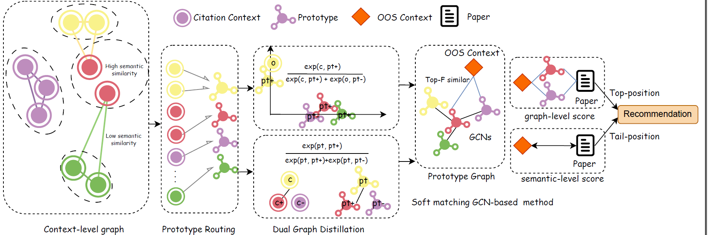

# Anonymous Repository for ARR Submission

This repository contains the code implementation for Rethinking Co-citation: A Context-Level Graph Model for Citation Recommendation, which is submitted to ARR 2026.

The repository is anonymized for double-blind review. All identifying information will be released after acceptance.


The overview of the proposed compressed graph model (CGM) is as follows:



### Dataset
We adopted 4 widely used public datasets, namely:
- FullPaperPeerRead
- ACL-200
- RefSeer
- ArXiv

### Phases
Our model can be tested with 2 phases:
- prefech: no candidates is reqired, recommend the citations from the entire corpus
- rerank: with provided candidate list, rerank the candidates in the candidate list.

---

## 1. Environment

### Requirement:
```md
- Python >= 3.10
- transformers==4.57.1
- torch == 2.9.0
- spacy==3.8.7
- scikit-learn==1.7.2

```

### Install the reqired python packages
```bash
pip install -r requirements.txt
```

## 2. Work flow
### Step 1: Data Preparation
To run our code, download data from  [Google Drive](https://drive.google.com/drive/u/0/folders/11n4YVHgUPfzetJi-y5voFpmRIjiBM0lQ)

To run our code with rerank phase, you need to generate a test file with candidate list. By default, we are using BM25 to form the candidate list of 100 candidates, adding in the target if target is not in the top 100.

```bash
python generate_candidates.py --dataset_root your_path_to_data --dataset_name peerread --model_type bm25 --top_k 100
```

This will generate a file test_candidates.json, stored in the same dataset folder, each test data is associated with 100 candidate for reranking.


### 2. Run Experiment
To quickly run the CMG model with different hyper-parameters, run bash in terminal:
```bash
bash run.sh
```

To test our model in prefecth phase, run:
```bash
CUDA_VISIBLE_DEVICES=0 python cgm.py --phase prefetch --dataset_root your_path_to_data --dataset_name peerread --top_k 1000 epochs 10 --num_node 2500 --mode hybrid --compression_mode --merge_num 4
```

To test our model in rerank phase, run:
```bash
CUDA_VISIBLE_DEVICES=0 python cgm.py --phase rerank --dataset_root your_path_to_data --dataset_name peerread --top_k 100 epochs 10 --num_node 2500 --mode hybrid --compression_mode --merge_num 4
```

### 3. Ablation Studies

Control of the following parameters for ablation studies:
- Vanilla: --mode vanilla
- w/o GC: 
- w/o structure
- w/o semantic
- w/o AGG
